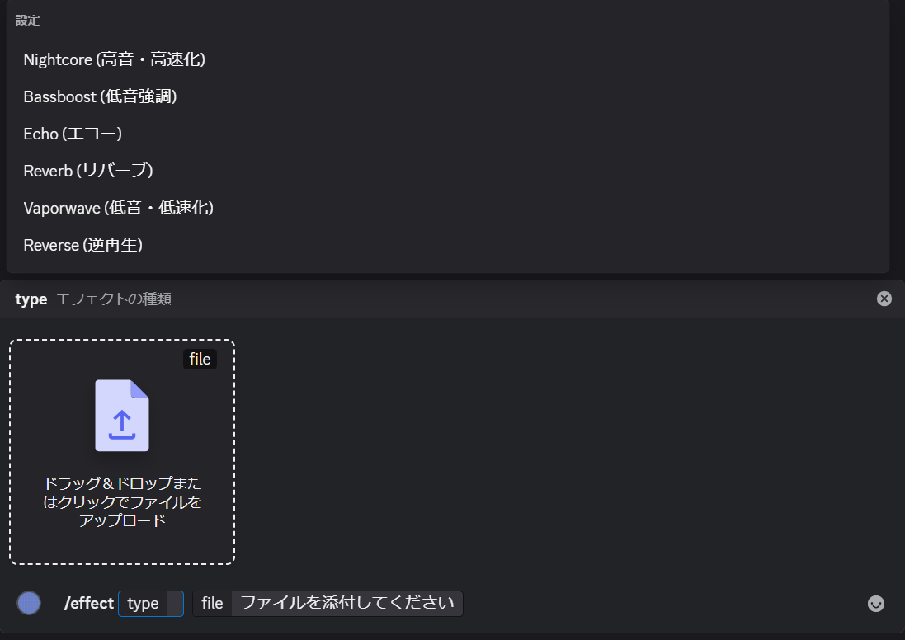

# AudioEffectBot

オーディオエフェクトを適用するdiscord bot

## Command
```
/effect <エフェクトの種類> <音声ファイル>
```
## スクリーンショット



## 現在登録されているエフェクト
- nightcore: 高音・高速化
- bassboost: 低音強調
- echo: エコー
- reverb: リバーブ
- vaporwave: 低音・低速化
- reverse: 逆再生

# セットアップ
1.リポジトリをクローン
```
git clone https://github.com/sagami121/AudioEffectBot.git
cd AudioEffectBot
```
2.必要なライブラリをインストール
```
npm install
```
3.プロジェクト直下に .env を作成して以下を記入：

```
DISCORD_TOKEN=Botトークン
CLIENT_ID=クライアントID
GUILD_ID=サーバーID
```
### 2. 起動
```bash
node index.js
```

### 3.スラッシュコマンドを削除したい場合
```bash
node clear-commands.js
```

# ライセンス
MITライセンスで公開されています。

